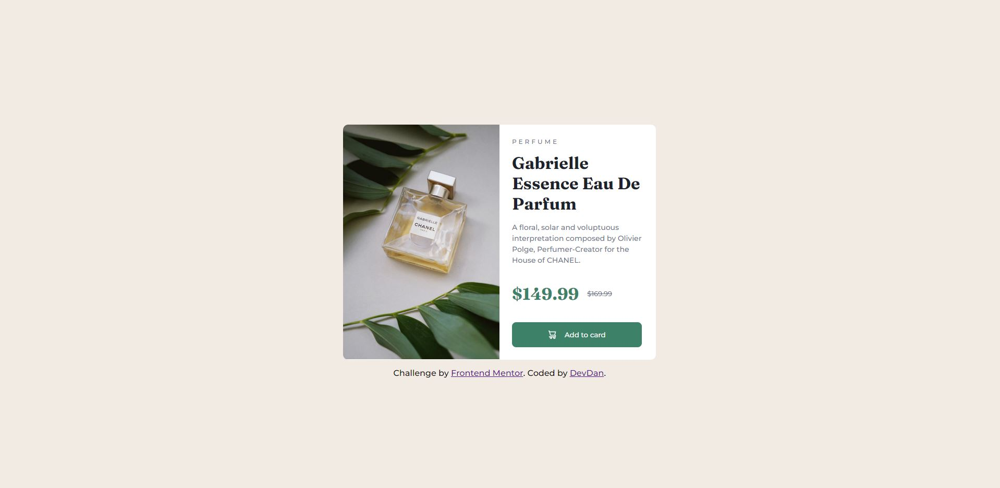

# Frontend Mentor - Product preview card component solution

This is a solution to the [Product preview card component challenge on Frontend Mentor](https://www.frontendmentor.io/challenges/product-preview-card-component-GO7UmttRfa). Frontend Mentor challenges help you improve your coding skills by building realistic projects.

## Table of contents

- [Overview](#overview)
  - [The challenge](#the-challenge)
  - [Screenshot](#screenshot)
  - [Links](#links)
- [My process](#my-process)
  - [Built with](#built-with)
  - [What I learned](#what-i-learned)
- [Author](#author)

## Overview

### The challenge

Users should be able to:

- View the optimal layout depending on their device's screen size
- See hover and focus states for interactive elements

### Screenshot

### Links

- Solution URL: [GitHub] (https://github.com/DevDan21/product-preview-card-component.git)
- Live Site URL: [Product Preview Card Component] (https://devdan21.github.io/product-preview-card-component/)

## My process

### Built with

- Semantic HTML5 markup
- CSS custom properties
- Flexbox
- CSS Grid
- Mobile-first workflow

### What I learned

I learned to get better at using media queries to make this design responsive for both mobile and desktop. For the first time I didn't have to struggle too much with making it desktop friendly which is a big win for me.

## Author

- Frontend Mentor - [@DevDan21](https://www.frontendmentor.io/profile/yourusername)
- Twitter - [@DoubleDan6](https://twitter.com/DoubleDan6)
- Linkedin - [DevonDaniels] (https://www.linkedin.com/in/devon-daniels-619606116/)
- Blog - [DevDan] (https://dev.to/devdan21)
